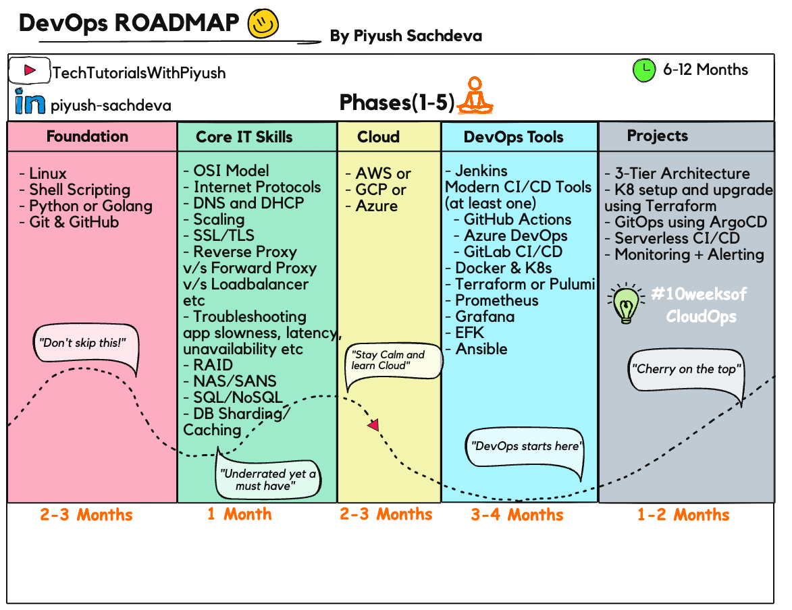

# 🚀 DevOps and Cloud Engineering Learning Path 2024

>Note: If you found the content helpful, consider giving the repository a star ⭐

## 🔗 Join our community 👇


<a href="https://youtube.com/@techtutorialswithpiyush"></img></a>
<a href="https://discord.com/invite/FMtJ2bVRUE"></img></a>
<a href="https://github.com/piyushsachdeva/"></img></a>
<a href="https://twitter.com/thecloudopscomm"></img></a>
<a href="https://www.linkedin.com/company/thecloudopscomm/"></img></a>
<a href="https://www.instagram.com/techtutorialswithpiyush/"></img></a>


## 📋 Table of Contents
- [About](#about)
- [Learning Path](#learning-path)
- [Projects](#projects)
- [Resources](#resources)
- [Contributing](#contributing)
- [License](#license)

## 🎯 About
This repository contains a structured learning path for beginners entering the DevOps and Cloud Engineering field. The curriculum is designed for students, recent graduates, and career switchers, with an estimated completion time of 6-12 months of dedicated learning.

## 📚 Learning Path




### Phase 1: Foundation (2-3 months)
#### Linux and Shell Scripting
```bash
# Topics:
├── Linux Administration
|   ├── Linux Installation
│   ├── Command Line Basics
│   ├── File System Management
│   ├── Process Management
│   ├── User Administration
│   └── Package Management
└── Bash Scripting
    ├── Variables and Data Types
    ├── Control Structures
    ├── Functions
    └── Automation Scripts
```

#### Programming Foundation
Choose one:
- **Python** (Recommended for beginners)
  - Basic syntax and data structures
  - Object Oriented Programming
  - File handling and automation
  - API integration
  - Libraries: requests, pandas, numpy
- **Golang**
  - Systems programming
  - Concurrent programming
  - Cloud-native development

#### Version Control
```bash
# Git & GitHub
├── Git Setup
├── Basic Commands
├── Branching Strategies
├── Git Flow
├── Pull Requests
├── Code Reviews
└── Collaborative Development
```

### Phase 2: Core IT Skills (1 month)
#### Network Fundamentals
- OSI Model - In-depth
- TCP/IP Protocol Suite
- Internet Protocols ( HTTP, HTTPS, SSH, SMTP, ICMP, etc)
- How to analyze network packets using tools such as Wireshark
- DDOS attack and how to mitigate that
- CIDR and Subnetting [Video Link](https://youtu.be/G1azmL5-eQI)
- DNS and DHCP [Video Link](https://youtu.be/fDOoB4k4YSs)
- Vertical V/s Horizontal Scaling
- SSL/TLS, symmetric vs asymmetric encryption and how it works : [Video Link](https://youtu.be/njT5ECuwCTo)
- Reverse Proxy V/s Forward Proxy V/s load balancer
- Troubleshooting application slowness, latency, unavailability etc
- RAID
- NAS vs SAN storage
- SQL vs NoSQL
- DB Sharding, Caching etc

### Phase 3: Cloud Computing (2-3 months)
Choose your cloud provider:
- Which Cloud Provider to choose? Confused? Watch the video below and you should be good
[Video link](https://youtu.be/K1U137j23p8)


| Cloud provider | Certification type | Certification | Tutorials |
|----------------|-------------------|---------------|-----------|
| AWS | Foundation<br>Associate | • AWS Certified Cloud Practitioner<br>• AWS Solutions Architect Associate | |
| Azure | Foundation<br>Associate | • AZ-900 Azure Fundamentals<br>• AZ-104 Azure Administrator | [Playlist](https://www.youtube.com/playlist?list=PLl4APkPHzsUUOCWcjaXcH-WBVxCccZ4uO)|
| GCP | Foundation<br>Associate | • Google Cloud Digital Leader<br>• Associate Cloud Engineer | [Playlist](https://www.youtube.com/playlist?list=PLl4APkPHzsUXvkDFARdrH2LMESVqeuH8W) |


>Note: Got more questions about the Cloud/DevOps Certifications? Watch the video below:

[Video Link](https://youtu.be/vATIASghb18)

### Phase 4: DevOps Tools (3-4 months)

#### 1. Containerization (Docker)
```bash
# Docker Fundamentals
├── Container Basics
├── Dockerfile Creation, Multi-Stage Builds
├── Image Management
├── Docker Compose
├── Container Networking
├── Docker Best Practices
└── Volume Management
```
Checkout the free YouTube playlist 👉 [here](https://www.youtube.com/playlist?list=PLl4APkPHzsUUOkOv3i62UidrLmSB8DcGC)

#### 2. Container Orchestration (Kubernetes)
Checkout the free YouTube playlist 👉 [here](https://www.youtube.com/playlist?list=PLl4APkPHzsUUOkOv3i62UidrLmSB8DcGC)

#### 3. CI/CD Pipeline
- Jenkins ( Checkout the free Youtube video [here](https://youtu.be/To-KzPB_EnE))
- Modern CI/CD Tools(at least one from below)
  - GitHub Actions
  - Azure DevOps (Checkout the free Youtube Playlist [here](https://www.youtube.com/playlist?list=PLl4APkPHzsUXseJO1a03CtfRDzr2hivbD))
  - GitLab CI/CD (Checkout the free Youtube video [here](https://youtu.be/uYaMRn2meJQ))

#### 4. Infrastructure as Code
```bash
# Terraform
├── HCL Syntax
├── Resource Management
├── State Management
├── Modules
└── Cloud Provider Integration
```

#### 5. Monitoring & Logging
- Prometheus & Grafana
- ELK Stack
- Fluentd

### Phase 5: 🛠️ Projects
- Check out the [Repo here](https://github.com/piyushsachdeva/10weeksofcloudops) for #10weeksofcloudops projects

## 📚 Learning Resources

### Official Documentation
- [Docker Docs](https://docs.docker.com/)
- [Kubernetes Docs](https://kubernetes.io/docs/)
- [Terraform Docs](https://www.terraform.io/docs/)

### YouTube Channels
- Tech Tutorials With Piyush

### Practice Platforms
- [Katacoda](https://www.katacoda.com/)
- [Play with Docker](https://labs.play-with-docker.com/)
- [Play with Kubernetes](https://labs.play-with-k8s.com/)

## 🤝 Contributing
Contributions are welcome! Please feel free to submit a Pull Request. For major changes, please open an issue first to discuss what you would like to change.

## 📜 License
This project is licensed under the MIT License - see the [LICENSE](LICENSE) file for details.

## ⭐ Support
If you found this helpful, please star this repository!

## 📬 Contact
For any queries or suggestions, please open an issue in this repository.

---
Made with ❤️ by [Piyush Sachdeva]
Last updated: October 2024
